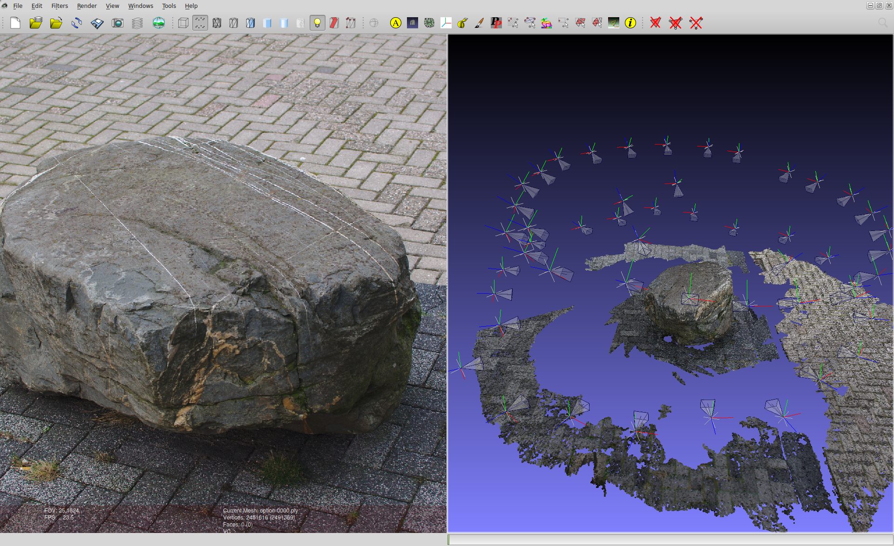

Structure From Motion Pipeline
------------------------------

This repo contains a complete _Structure from Motion_ pipeline. Structure from Motion is a technique to construct a 3-D point cloud from a set of images (or a video) of an object. The software in this repository relies heavily on a number of third party libaries, notably Bundler, CMVS, PMVS, and SIFT.

* Go [here](docs/install-ubuntu-14.10.md) for the installation instructions;
* A conceptual overview of the pipeline is documented [here](docs/structure_from_motion.md);
* The current pipeline has many options that can be configured. [This document](/docs/tuning_guide.md) describes which option does what and how it affects the characteristics of the resulting point cloud;
* [This](docs/related_work.md) document lists a couple of key people, their websites, and tools;
* [Here](docs/ideas.md) we describe some ideas we never found time to look into;
* You can run the pipeline with [docker](https://www.docker.com/) [using this image](https://registry.hub.docker.com/u/nlesc/structure-from-motion). Find the instructions [here](docs/docker.md).

Example
--------

Copyrights & Disclaimers
------------------------

The software is copyrighted by the Netherlands eScience Center and 
releases under the GNU general public license (GPL), Version 2.0.

See <http://www.esciencecenter.nl> for more information on the 
Netherlands eScience Center.

See the "LICENSE" and "NOTICE" files for more information. 

