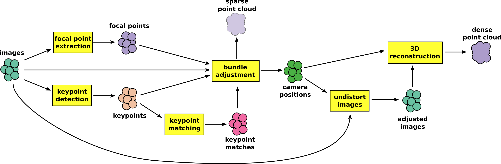

Structure From Motion
=====================

Structure from motion is a technique where a collection of images of a single object is transformed into a pointcloud.

See the Wikipedia page on Structure from Motion: http://en.m.wikipedia.org/wiki/Structure_from_motion

Basic Workflow
--------------

The process consists of 6 basic steps shown in the workflow below:

- focal point extraction -- extract the focal point and sensor size from the exif information in each image.
- keypoint detection -- detects "point of interest" in each image.
- keypoint matching -- compare keypoints of each image pair to see if and how they overlap.
- bundle adjustment -- determine the camera positions in each image, using multiple overlapping images as input. This also produces an initial sparse pointcloud.
- undistort images -- fix any distortion in the images caused by the camera.
- reconstruction of 3D structure -- combine the images into a dense pointcloud.

There are many different implementations for each step in this workflow. In our workflow we use the following combination of tools:

- [SIFT](http://www.cs.ubc.ca/~lowe/keypoints/) for keypoint detection. Note that SIFT is patented and can only be used for research purposes. 
- [Bundler](http://www.cs.cornell.edu/~snavely/bundler/) for keypoint matching, bundle adjustment and undistort images. 
- [CMVS/PMVS2](http://www.di.ens.fr/cmvs/) to reconstruct the 3D structure using multi-view stereo.

Note that we don't use the original versions provides in the links above, but instead take more up-to-date versions from github. The details can be found in the 
[install guide](./install-ubuntu-14.10.md).

